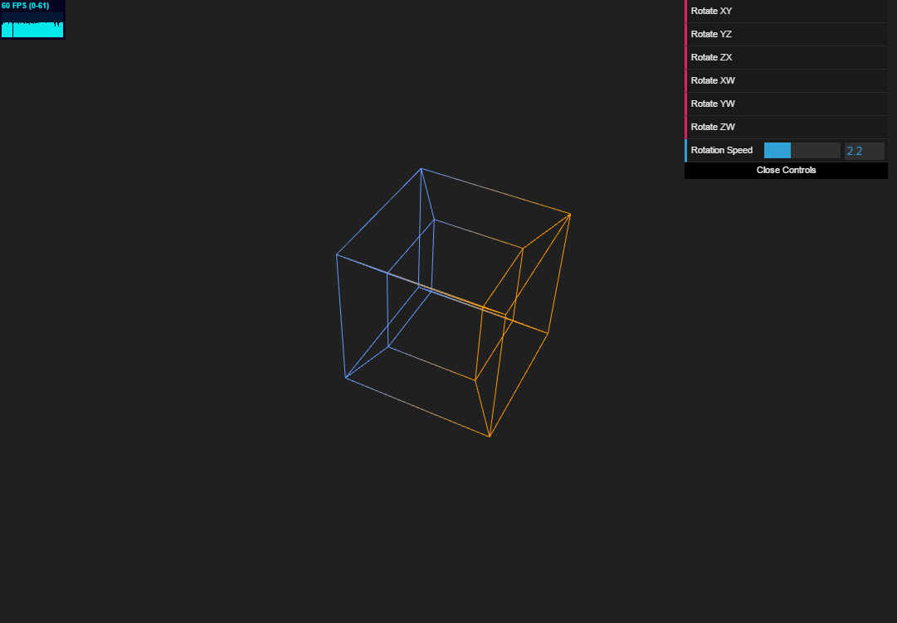

## What is this sorcery?

hyper is a visualization of a rotating 4D cube (aka hypercube or tesseract) based on Steven Richard Hollasch's thesis [Four-Space Visualization of 4D Objects](http://steve.hollasch.net/thesis/).

